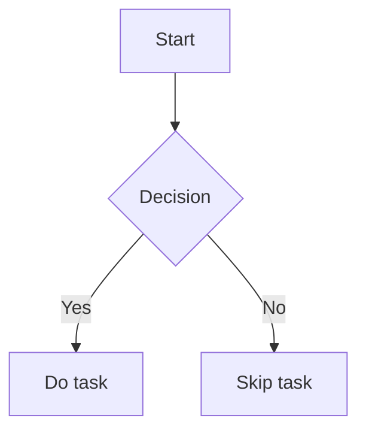

# Obsidian Skill

Obsidian uses an extended Markdown dialect with several powerful features. This skill
ensures output is idiomatic, vault-ready, and follows Obsidian best practices.

---

## Core Syntax Reference

### Frontmatter (YAML)

Every note should open with YAML frontmatter unless the user asks for a bare note.
Frontmatter goes between `---` fences at the very top of the file.

```yaml
---
title: "Note Title"
---
```

**Rules:**
- `title` should match the filename (without `.md`)

---

### Math & LaTeX
 
Obsidian renders LaTeX via MathJax. No plugin needed — it's built in.
 
#### Inline Math
 
Wrap with single `$` delimiters. Renders inside a sentence:
 
```markdown
The quadratic formula is $x = \frac{-b \pm \sqrt{b^2 - 4ac}}{2a}$.
 
Euler's identity: $e^{i\pi} + 1 = 0$ is often called the most beautiful equation.
 
A vector $\vec{v} \in \mathbb{R}^n$ has magnitude $\|\vec{v}\| = \sqrt{\sum_{i=1}^n v_i^2}$.
```
 
#### Display Math (Block)
 
Wrap with `$$` on its own lines. Centers and enlarges the expression:
 
```markdown
$$
\int_{-\infty}^{\infty} e^{-x^2} \, dx = \sqrt{\pi}
$$
 
$$
\nabla \times \vec{B} = \mu_0 \vec{J} + \mu_0 \varepsilon_0 \frac{\partial \vec{E}}{\partial t}
$$
```

---

### Callouts (Admonitions)

Obsidian's callout syntax (renders as colored callout boxes):

```markdown
> [!NOTE]
> General note or aside.

> [!TIP]
> Helpful tip.

> [!WARNING]
> Something to be careful about.

> [!IMPORTANT]
> Critical information.

> [!QUESTION]
> Open question or thing to investigate.

> [!QUOTE]
> A quotation from a source.

> [!EXAMPLE]
> Concrete example.

> [!SUMMARY]
> Key takeaways or TL;DR.
```

Callouts can be collapsed by adding `+` (open) or `-` (closed) after the type:

```markdown
> [!NOTE]- Collapsible (starts closed)
> Hidden content.
```

---

### Mermaid Diagrams

Obsidian supports Mermaid diagrams in fenced code blocks.

````markdown

````

---

### Block References

Assign a block ID to any paragraph to allow direct linking:

```markdown
This is a paragraph I want to reference. ^my-block-id
```

Link to it from elsewhere:

```markdown
See [[Note Name#^my-block-id]]
```

Block IDs: lowercase, hyphens, no spaces.

---

## Formatting Conventions

- **Headings**: Use `##` and below inside a note body. `#` is effectively the note title (from filename/frontmatter).
- **Bold** for key terms on first appearance or for emphasis.
- *Italics* for titles of works, foreign phrases, or gentle emphasis.
- `Code` for technical terms, commands, filenames.
- Use `---` horizontal rules to separate major sections, like chapters.
- Numbered lists for sequences; bullet lists for unordered collections.
- Keep paragraphs short (2–4 sentences). Obsidian is for thinking, not essays.

---

## Linking Strategy

- Don't link other notes, only use external links or block links.